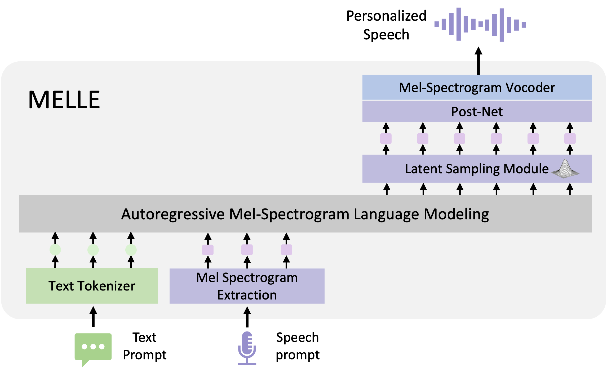

# MELLE: Autoregressive Speech Synthesis without Vector Quantization


<div align="center">

</div>

**Abstract**: We present MELLE, a novel continuous-valued tokens based language modeling approach for text to speech synthesis (TTS). 
MELLE autoregressively generates continuous mel-spectrogram frames directly from text condition, bypassing the need for vector quantization, 
which are originally designed for audio compression and sacrifice fidelity compared to mel-spectrograms. Specifically, 
(i) instead of cross-entropy loss, we apply regression loss with a proposed spectrogram flux loss function to model the probability distribution of the continuous-valued tokens. 
(ii) we have incorporated variational inference into MELLE to facilitate sampling mechanisms, thereby enhancing the output diversity and model robustness. 
Experiments demonstrate that, compared to the two-stage codec language models VALL-E and its variants, the single-stage MELLE mitigates robustness issues by 
avoiding the inherent flaws of sampling discrete codes, achieves superior performance across multiple metrics, and, most importantly, offers a more streamlined paradigm. 

<br>

**Paper**: https://arxiv.org/abs/2407.08551

**Please also check**: https://aka.ms/melle

**Citation:**
```
@article{meng2024melle,
  title={Autoregressive Speech Synthesis without Vector Quantization}, 
  author={Lingwei Meng and Long Zhou and Shujie Liu and Sanyuan Chen and Bing Han and Shujie Hu and Yanqing Liu and Jinyu Li and Sheng Zhao and Xixin Wu and Helen Meng and Furu Wei},
  journal={arXiv preprint arXiv:2407.08551},
  year={2024}
}
```
